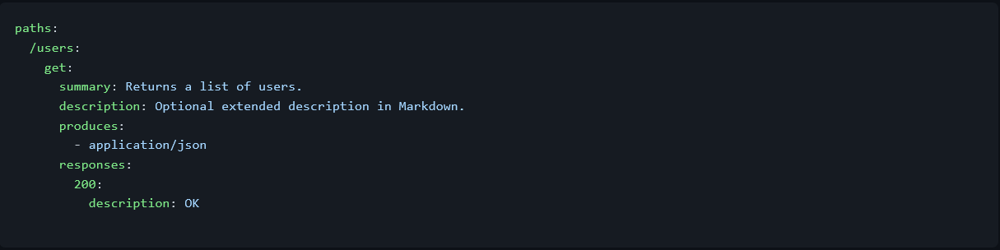
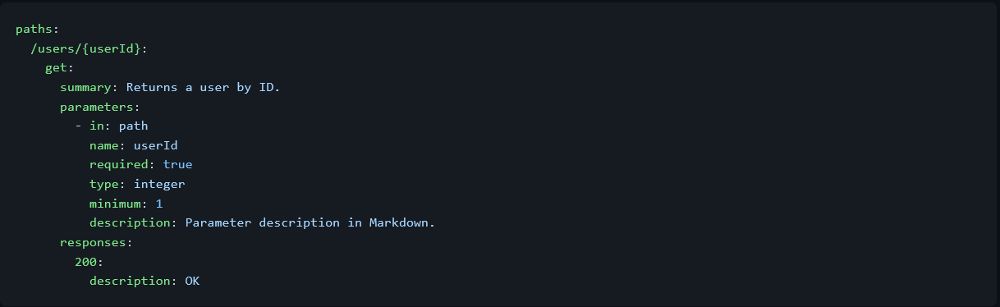
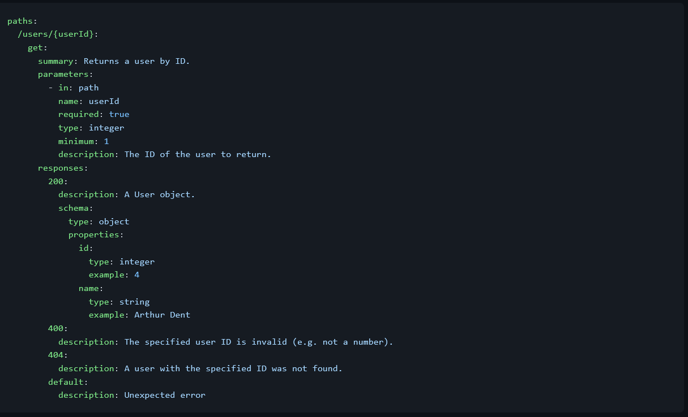

# Nodejs TypeScript Starter

Starter app with those tools included and configured:

-   [TypeScript](https://www.typescriptlang.org/) 4.5
-   [Express](http://expressjs.com/) Fast, unopinionated, minimalist web framework for Node.js
-   [ESLint](https://eslint.org/) with some initial rules recommendation
-   [Jest](https://jestjs.io/) for fast unit testing and code coverage
-   Type definitions for Node.js and Jest
-   [Prettier](https://prettier.io/) to enforce consistent code style
-   [Husky](https://typicode.github.io/husky) for git hooks
-   [Commitlint](https://commitlint.js.org) Lint commit messages to respect [Conventional Commits spec](https://www.conventionalcommits.org/en/v1.0.0-beta.2/)
-   [Yarn](https://yarnpkg.com/) Package manager
-   [Swagger](https://swagger.io/) For Api documentation (see [swagger](#swagger) section).
-   NPM [scripts](#available-scripts) for common operations
-   Simple example of TypeScript code and unit test
-   `.editorconfig` for consistent file format

## Getting Started

This project is intended to be used with the latest Active LTS release of [Node.js](https://nodejs.org).

### Clone repository

To clone the repository, use the following commands:

```sh
git clone https://github.com/atefBB/node-ts-starter
cd node-ts-starter
yarn
```

### Folder structure

We propose a folder structure like the following:

<pre>
	.
	├── .vscode // vscode shared extensions & settings
	├── package.json
	├── .env.example // env variables sample file
	├── README.md // this file
	├── __tests__ // tests files (TDD)
	├── src
	│   ├── index.ts // entry point of the app
	│   ├── helpers // helpers functions
	│   ├── controllers // controllers folder
	│   ├── routes // routes folder
	│   └── types // custom/shared types
	├── tsconfig.json // typescript config file
	├── tsconfig.paths.json // paths alias (using `@folder/sub_folder` instead of `../../folder/sub_folder` in `import` statements)  
	└── yarn.lock
</pre>

## Application architecture

Our architecture is inspired by `MVC` design pattern

-   `Controller`: The controller receives the request, then transmits it to the responsible `service` then returns the result.
-   `Router`: It determine how to respond to a `client request` to a particular `endpoint`, which is a `URI` (or path) and a specific `HTTP` request method (GET, POST, ...).
-   `Model`: It present an abstraction of the database (TODO).
-   `View`: It present the data to the end user (TODO).

For more information about routing see [expressjs docs](https://expressjs.com/en/starter/basic-routing.html).

### Bootstrap

-   Install app dependencies with hitting `yarn` command in your favorite `terminal`.
-   copy `.env.example` to `.env` and adjust it.
-   Hit `yarn start` and you `mostly` ready to GO.

### Git workflow

We choose to use a modified version of `feature branch` workflow, so every `feature branch` should be a `child` of `dev` branch (not `main` nor `master` branch). For each new feature:

-   `switch` to `dev` branch, `git fetch`/`git pull`.
-   create a branch with the name of the new feature.
-   commit the work.
-   hit `git pull --rebase origin dev` (see info about this [here](http://gitready.com/advanced/2009/02/11/pull-with-rebase.html))
-   `push` the work to `remote repo`.
-   as n optional step, send a `pull request`/`merge request`/`request pull` to review/merge the feature branch to `dev` ().

For more information about `feature branch` workflow, see those links: [1](https://www.atlassian.com/git/tutorials/comparing-workflows/feature-branch-workflow), [2](https://git-scm.com/book/en/v2/Git-Branching-Branching-Workflows), [3](https://bocoup.com/blog/git-workflow-walkthrough-feature-branches).

### Typing convention

We are trying to respect those **rules**:

-   Avoid using `any` as possible as you can!
-   Provide types for every thing: controllers, helpers, ...
-   Create a `shared types` of `a group of logic`.
-   Use `type` statement to define types (not `interface`).
-   Use `typescript basic types` as possible as you can (see [this link](https://www.typescriptlang.org/docs/handbook/basic-types.html) for more info).
-   Don't go crazy with your types (and don't lose your mind meanwhile!).

### Commits Rules

We use [conventional commits](https://www.conventionalcommits.org/en/) rules for commits. Please use `git cz` which help you to respect those conventions (see [this link](https://github.com/streamich/git-cz) for installation and mre info about it).

## Swagger

### Installation

```sh
yarn add swagger-jsdoc swagger-ui-express
```

### Paths

The paths section defines individual endpoints (paths) in your API, and the HTTP methods (operations) supported by these endpoints. For example, GET /users can be described as:


More info: [Paths and Operations](https://swagger.io/docs/specification/2-0/paths-and-operations/).

### Parameters

Operations can have parameters that can be passed via URL path (/users/{userId}), query string (/users?role=admin), headers (X-CustomHeader: Value) and request body. You can define the parameter types, format, whether they are required or optional, and other details:


More info: [Describing Parameters](https://swagger.io/docs/specification/2-0/describing-parameters/).

### Responses

For each operation, you can define possible status codes, such as 200 OK or 404 Not Found, and schema of the response body. Schemas can be defined inline or referenced from an external definition via $ref. You can also provide example responses for different content types.


More info: [Describing Responses](https://swagger.io/docs/specification/2-0/describing-responses/).

## Available Scripts

-   `start` - start development demon,
-   `build` - transpile TypeScript to ES6,
-   `build:watch` - interactive watch mode to automatically transpile source files,
-   `test` - run tests,
-   `test:watch` - interactive watch mode to automatically re-run tests

## Additional Information

### Writing tests in JavaScript

Writing unit tests in TypeScript can sometimes be troublesome and confusing. Especially when mocking dependencies and using spies.

This is **optional**, but if you want to learn how to write JavaScript tests for TypeScript modules, read this [wiki page][https://github.com/jsynowiec/node-typescript-boilerplate/wiki/unit-tests-in-plain-javascript].

## TODO

-   Add `knexjs` integration
-   Add `unit tests` boilerplate

## License

No License

## Authors

-   [Atef Ben Ali](mailto:atef.bettaib@gmail.com)
